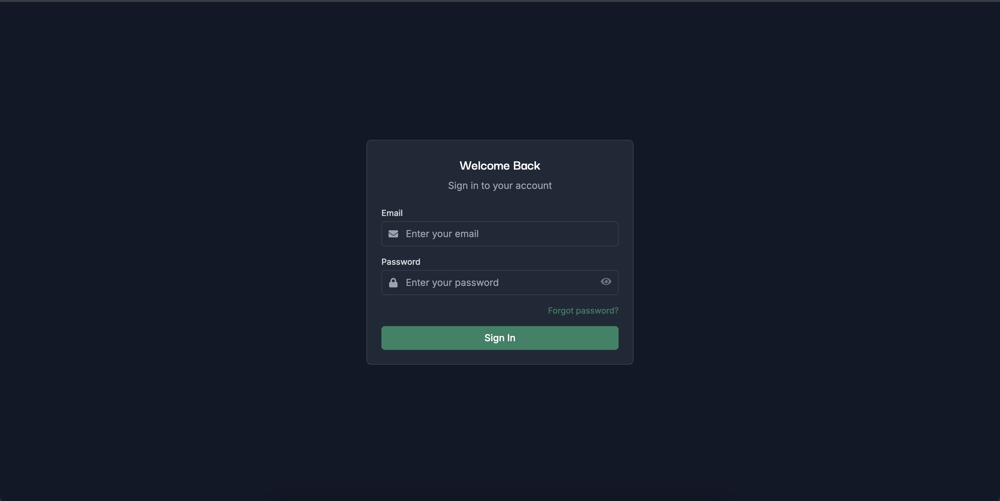
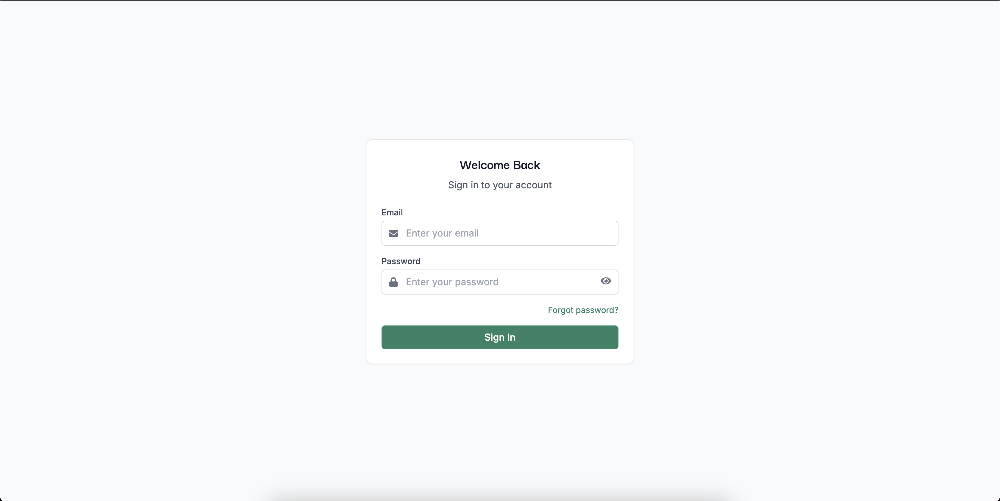
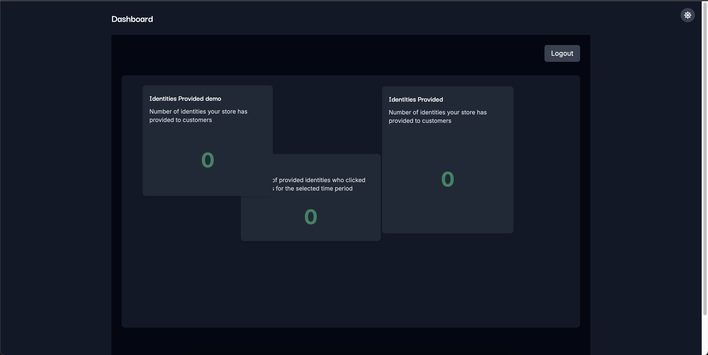
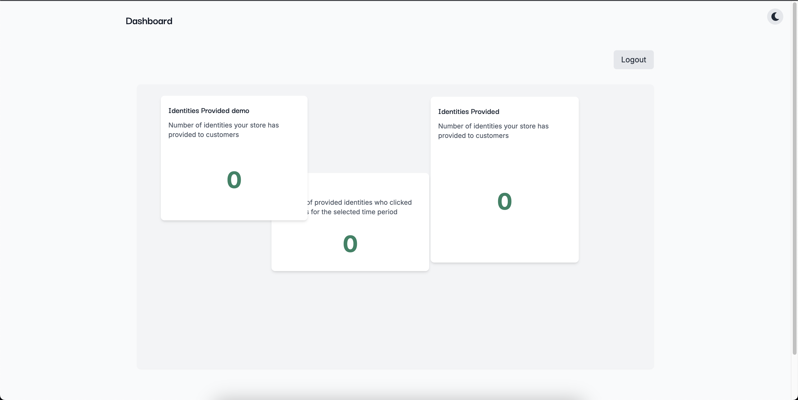
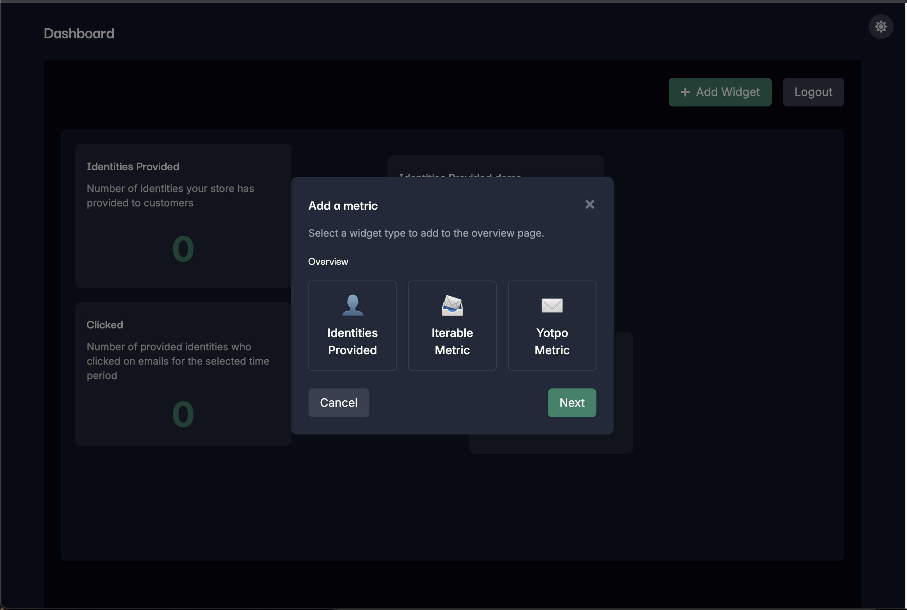
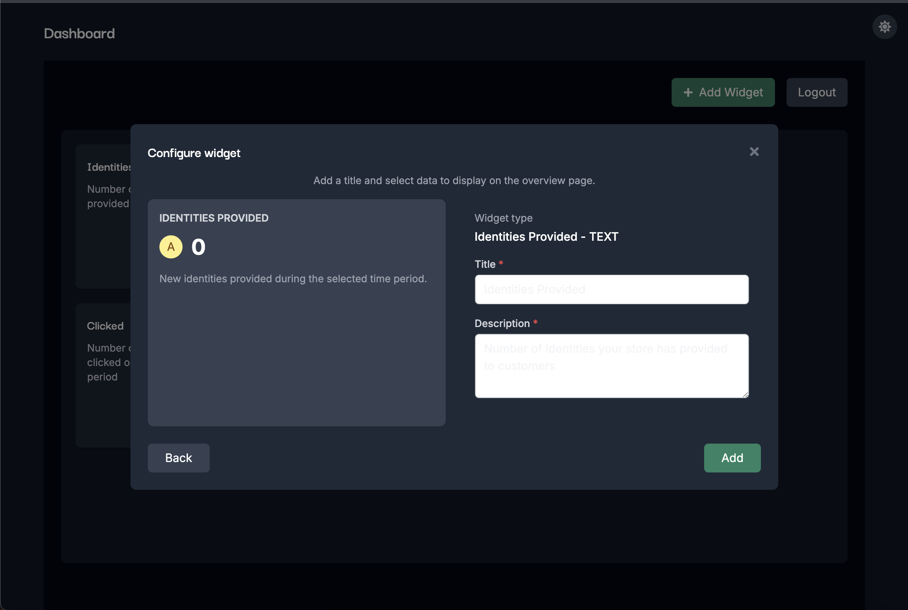
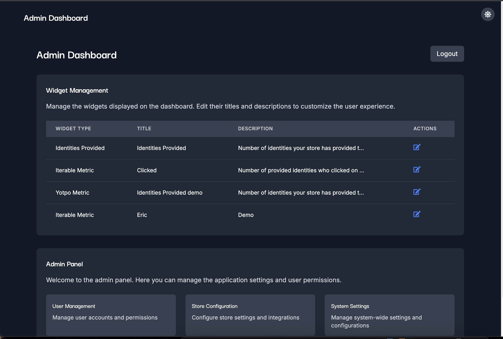
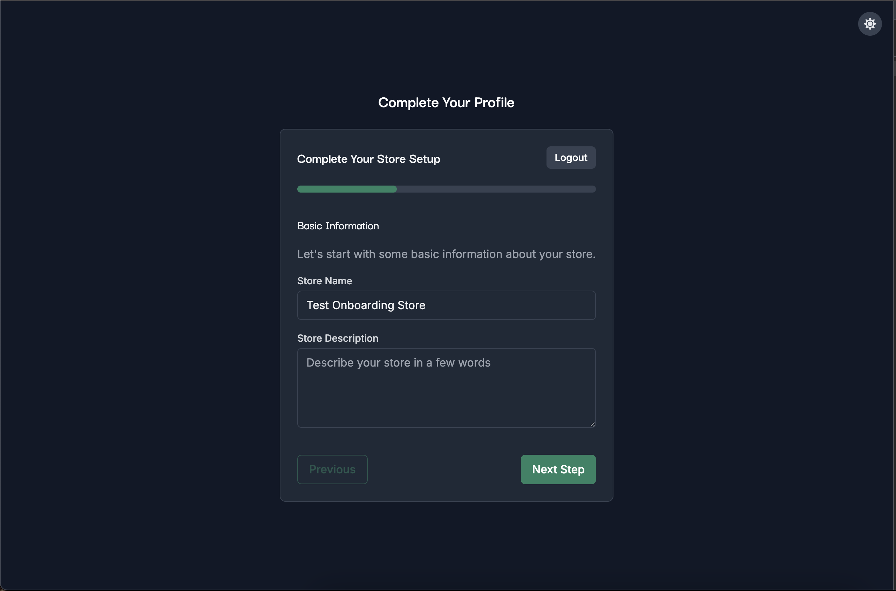
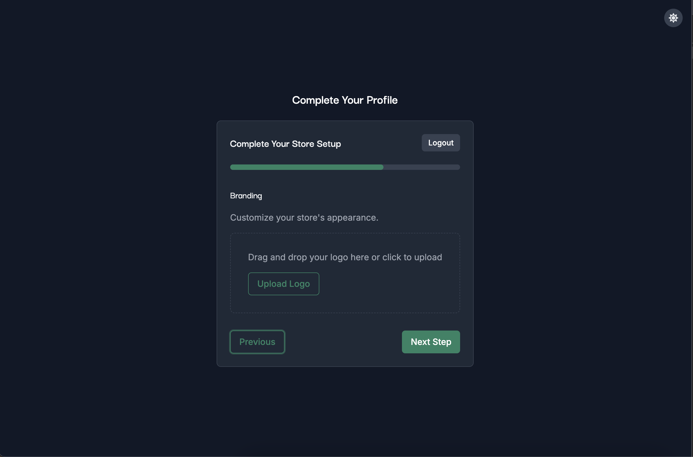

# OpenSend Login

A React application with TypeScript using Vite for OpenSend login and dashboard functionality.

## Features

- Login form with validation
- Conditional routing based on user type
- Dynamic dashboard with draggable and resizable widgets
- Dark mode / light mode support
- Responsive design

## Tech Stack

- React 18
- TypeScript
- Vite
- Redux Toolkit with RTK Query
- React Router DOM
- React DnD (Drag and Drop)
- React Resizable
- TailwindCSS
- React Icons

## Getting Started

### Prerequisites

- Node.js (v14 or higher)
- npm or yarn

### Installation

1. Clone the repository
2. Install dependencies:

```bash
npm install
# or
yarn
```

3. Start the development server:

```bash
npm run dev
# or
yarn dev
```

4. Open your browser and navigate to `http://localhost:5173`

## Test Accounts

- Client: `test+member@yopmail.com` / `12345678`
- Admin: `test+admin@yopmail.com` / `12345678`
- Onboarding: `test+onboarding@yopmail.com` / `12345678`

## API Endpoints

- Base URL: `https://stgapp-bwgkn3md.opensend.com`
- Login: `/auth/login`
- Get user profile: `/self/profile`
- Get store info: `/store/{id}`

## Authentication

After login, the server returns two tokens:

- Access token
- Client token

These tokens are included in subsequent request headers:

- `Access-Token: Bearer <access_token>`
- `Client-Token: <client_token>`

## Preview

Login page



Member dashboard





Admin


Onboarding



## License

This project is licensed under the MIT License.
